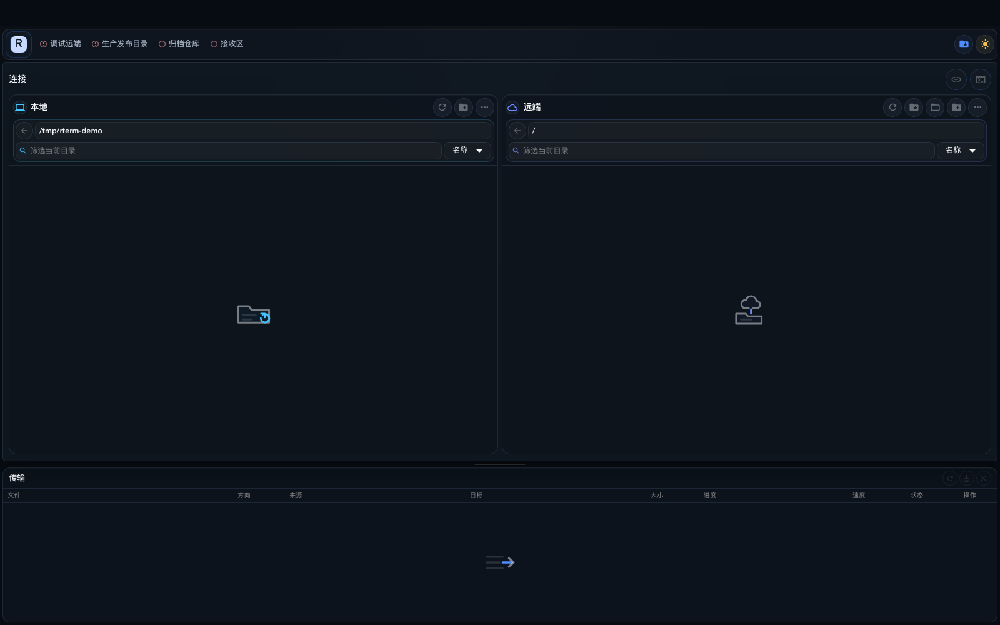

# rTerm 界面与公开演示说明

rTerm 是本地优先的远程目录工作台。公开界面截图只展示连接工作台的布局与空状态，不连接真实服务器，也不读取个人文件。

## 工作台

工作台由顶部连接上下文、本地目录、远端目录和传输队列组成：

- 本地与远端目录可以分别刷新、筛选、排序和执行文件操作。
- 连接、收藏、终端和传输操作都以当前选中的主机为上下文。
- 传输队列保留文件名、方向、来源、目标、进度和状态，便于重试或清理记录。
- 未连接时显示安全的空状态，不能误把本地路径当成远端目录。

截图中的本地目录 `/tmp/rterm-demo`、远端根目录 `/` 和空列表都是公开演示占位值；`/tmp/rterm-demo` 不代表仓库维护者的真实目录。

## 建议的首次使用顺序

1. 先打开主机配置，创建一个仅用于测试的连接。
2. 使用 `connections test --json` 验证连接，再打开目录浏览。
3. 先执行只读浏览或预览，再进行上传、下载、移动和删除。
4. 传输完成后核对目标目录和队列状态，再清理历史记录。

密码、私钥、token、内网地址和业务目录只能保存在本机私有配置中，不应出现在 README、截图、Issue、日志或示例命令中。

## 公开截图规则

- 只使用 `/tmp/rterm-demo`、`example.com`、空状态和仓库内置 fixture。
- 截图前检查地址栏、目录字段、错误信息和终端输出，不得包含真实主机、用户名或绝对用户路径。
- 截图来自本地 web 预览，不代表已连接生产服务器，也不是 Playwright 或冒烟测试结果。

相关入口：[README](../README.md)、[公开仓库边界](../PUBLIC_REPOSITORY.md)、[安全报告](../SECURITY.md)、[发布说明](../RELEASE.md)。
